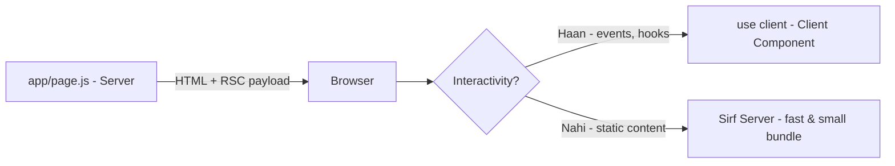

# 01 - Next.js Fundamentals

> Next.js ka deep dive learning repo — basics se lekar routers, rendering aur real-life usage tak, sab kuch Hinglish mein samjhaya gaya hai 📚

---

## 📖 Table of Contents

- [What is Next.js](#-what-is-nextjs)
- [Why Next.js Recommended Hai?](#-why-nextjs-recommended-hai)
- [Installation](#-installation)
- [What is Router?](#-what-is-router)
- [App Router vs Pages Router](#-app-router-vs-pages-router)
- [Next.js vs React.js](#-nextjs-vs-reactjs)
- [Diagrams & Architecture](#-diagrams--architecture)
- [Real Life Usages](#-real-life-usages)
- [Is Repo Ki Project Structure](#-is-repo-ki-project-structure)
- [Code Snippets & Files](#-code-snippets--files)
- [Resources](#-resources)

---

## 🚀 What is Next.js

**Next.js** ek **React-based full-stack framework** hai jo React ke upar ek layer add karta hai. Iska matlab — React single-handedly sirf UI banata hai (client-side), lekin Next.js usse ek **production-ready** framework banata hai jisme aata hai:

- **Routing** (file-based routing)
- **Server Components** (React 19 ka bada feature)
- **SSR / SSG / ISR** (server-side rendering strategies)
- **API Routes** (backend bhi likh sakte ho)
- **Image Optimization** (built-in `<Image>` component)
- **SEO-friendly** (metadata, og-tags, sitemaps)

React sirf ek **library** hai (UI ke liye), lekin Next.js ek **framework** hai (poora ecosystem + konvention).

### Core Concept: Server vs Client

Next.js 13+ mein by default **all components server components** hote hain. Matlab — wo component **server par render** hota hai, bundle mein nahi aata, aur `console.log` browser mein nahi balki **terminal** mein dikhega.

```jsx
// app/page.js — default server component
export default function Home() {
  console.log("Ye terminal mein print hoga, browser nahi");
  return <h1>Hello Next.js!</h1>;
}
```

Client component banane ke liye top par `"use client"` directive lagao:

```jsx
// app/counter.jsx
"use client";

import { useState } from "react";

export default function Counter() {
  const [count, setCount] = useState(0);
  return <button onClick={() => setCount(count + 1)}>Count: {count}</button>;
}
```

---

## 💡 Why Next.js Recommended Hai?

### 1. SEO (Search Engine Optimization)
React SPA ka content JavaScript se banta hai, toh Google ko (mostly) sirf khali HTML dikhta hai. Next.js **pre-rendered HTML** bhejta hai jo search engines turant index kar sakte hain.

### 2. Performance by Default
- Automatic code-splitting → page load karte waqt sirf zaroori JS aati hai
- Image optimization → `next/image` auto-compress + lazy-load karta hai
- Static assets caching out-of-the-box

### 3. Full-Stack ek Hi Framework Mein
Frontend + Backend (API routes/server actions) — alag-alag server, alag deploy karne ki zaroorat nahi.

### 4. File-Based Routing
`app/about/page.js` create karte hi `/about` route ban gaya. Koi router config nahi, koi extra dependency nahi.

### 5. Vercel ke Saath Seamless Deploy
Vercel ke creators ne Next.js banaya hai — `vercel deploy` karte hi app live ho jata hai.

```bash
npm run build
npx vercel --prod   # ek command deploy
```

### 6. Huge Ecosystem & Community
- 88k+ GitHub stars
- MongoDB, Supabase, Auth.js, Stripe — sabke official guides Next.js ke liye exist karte hain
- Templates & boilerplates kaafi milte hain

---

## 💻 Installation

Next.js install karne se pehle **Node.js 18.18+** hona chahiye (`node -v` se check karo).

### Option 1: create-next-app (Recommended)

```bash
npx create-next-app@latest 01-nextjs-fundamentals
```

Interactive prompts:
```
✔ What is your project named? … 01-nextjs-fundamentals
✔ Would you like to use TypeScript? … No / Yes
✔ Would you like to use ESLint? … ‣ Yes
✔ Would you like to use Tailwind CSS? … Yes
✔ Would you like your code inside a `src/` directory? … No
✔ Would you like to use App Router? … ‣ Yes
✔ Would you like to use Turbopack? … Yes
```
> Note: `bun create next-app` ya `pnpm create next-app` bhi chalta hai agar wo package manager use karte ho.

### Option 2: Manual Install (Full Control)

```bash
mkdir 01-nextjs-fundamentals
cd 01-nextjs-fundamentals
npm init -y
npm install next@latest react@latest react-dom@latest
npm install -D tailwindcss @tailwindcss/postcss eslint eslint-config-next
```

Phir `package.json` mein scripts add karo:

```json
{
  "scripts": {
    "dev": "next dev",
    "build": "next build",
    "start": "next start",
    "lint": "eslint"
  }
}
```

Aur `app/` folder banao:

```jsx
// app/page.js
export default function Home() {
  return <h1>Hello Next.js!</h1>;
}
```

### Dev Server Chalana

```bash
npm run dev
# Open: http://localhost:3000
```

| Command | Kya karta hai |
|---------|--------------|
| `npm run dev` | Development server (hot reload ke saath) |
| `npm run build` | Production build banata hai |
| `npm run start` | Production server chalu karta hai (pehle build zaroori) |
| `npm run lint` | ESLint checks karta hai |

---

## 🧭 What is Router?

**Router** = URL ko **UI/page se map** karne ka mechanism.

Jab user `/about` visit karta hai, toh router decide karta hai ki kaunsa component render hona chahiye.

### File-Based Routing (Next.js ka tarika)

Next.js mein aap koi routing config **nahi** likhte. Sirf files/folders banate ho — **folder = route path**, `page.js` = us page ka content.

```
app/
├── page.js          →  →  /            (home page)
├── about/
│   └── page.jsx     →  →  /about
└── contact/
    └── page.jsx     →  →  /contact
```

### Dynamic Routes (URL mein variable)

```
app/
└── blog/
    ├── page.jsx            →  /blog
    └── [slug]/
        └── page.jsx        →  /blog/:slug
```

```jsx
// app/blog/[slug]/page.jsx
export default async function BlogPost({ params }) {
  const { slug } = await params; // Next 15+ mein params await karna padta hai
  return <h1>Blog Post: {slug}</h1>;
}
```

### Linking (Client-side navigation)

```jsx
import Link from "next/link";

export default function Navbar() {
  return (
    <nav>
      <Link href="/about">About</Link>
      <Link href="/contact">Contact</Link>
    </nav>
  );
}
```

> `Link` component **client-side** navigation deta hai — poori page reload nahi hoti, bas baaki routes background mein prefetch ho jaate hain (fast UX).

---

## 🔄 App Router vs Pages Router

Next.js ke 2 routing systems hain:

| Feature | Pages Router (legacy) | App Router (current) ✅ |
|---------|----------------------|------------------------|
| Release | Next.js < 13 (2016+) | Next.js 13 (2023+) |
| File convention | `pages/about.js` | `app/about/page.js` |
| Default rendering | Client components se SSR | **Server components** (faster) |
| Layouts | Alag `_app.js`, `_document.js`, custom logic | Built-in `layout.js` — ko mela de kar nested layout banao |
| Data fetching | `getServerSideProps`, `getStaticProps` | Server Components mein direct `await fetch()` |
| API routes | `pages/api/hello.js` | `app/api/hello/route.js` |
| Middleware | `middleware.js` (root) | Same, but modern config |
| **Status** | ⚠️ Stable but **deprecated** (Next 16 mein hata diya gaya) | 🟢 **Future & standard** |

### Astra ucha App Router kyun?

1. **Nested layouts** — header/footer/sidebar ek baar banao, har nested route mein re-use ho jayege
2. **Server components** — data fetch server par hota hai, bundle chhota hota hai
3. **Streaming** — page ka loading state stream ho sakta hai
4. **React 19 features** — actions, transitions naturally support

### Layout Example

```jsx
// app/layout.js — root layout (har page par chalega)
export default function RootLayout({ children }) {
  return (
    <html lang="en">
      <body>
        <header>Site Header</header>
        <main>{children}</main>
        <footer>Site Footer</footer>
      </body>
    </html>
  );
}
```

---

## ⚔️ Next.js vs React.js

| Point | React.js | Next.js |
|-------|----------|---------|
| Type | **Library** (sirf UI) | **Framework** (full-stack) |
| Routing | `react-router-dom` install karna padta hai | File-based, built-in |
| SEO | Poor (client-side render) | Excellent (SSR/SSG) |
| Data fetching | `useEffect` + client code | Server components mein direct `fetch` |
| Backend | Koi backend nahi, alag server banani padti hai | API routes + server actions built-in |
| Bundling | Webpack/Vite alag se configure | Auto (Turbopack + SWC) |
| Deployment | Static host + build setup | Vercel (1 command) |
| Performance | Client opens hollow HTML | Pre-rendered HTML + streaming |

### Jab React sah ho, tab React use karo?
- Pure client-side app (dashboard with login wall — no SEO needed)
- SPA jo webpack/vite se already chal raha hai
- Sirf UI component library banani ho

### Jab Next.js use karo?
- Public content / SEO chahiye (blogs, e-commerce, marketing sites)
- Full-stack app ek hi codebase mein
- High-performance app chaheye out-of-the-box

> **Dono ka rishta:** Next.js, React ke upar bana hai. React ki poori knowledge Next.js mein bhi kaam aati hai — Next.js bas usko framework-level powers deta hai.

---

## 🗺️ Diagrams & Architecture

### 1. Next.js Architecture — ek request ka full journey

```
User Browser
     │
     │  GET /about
     ▼
┌──────────────────────────────────────────────┐
│                Next.js Server                │
│                                              │
│  1. Router ──→ file matching (app/about/page) │
│  2. Server Component render ho raha hai       │
│  3. Data fetch (server par)                  │
│  4. HTML ban gaya ──→ client ko bhejo        │
│  5. React hydration (JS attach hota hai)     │
└──────────────────────────────────────────────┘
     │
     ▼
Browser ko mila:  Pre-rendered HTML + Hydrated React app
```

### 2. React.js (SPA) Architecture

```
Browser awal:  <div id="root"></div>  ← khali div, koi content nahi
                              │
                              ▼
                     JS bundle download
                              │
                              ▼
              React JS run hota hai (client)
                              │
                              ▼
                   Content ab dikhta hai
               (SEO ke liye bhoot der / nahi dikhta)
```

> Isliye React SPA **slow & SEO-bad** — content sirf JS chalne ke baad dikhta hai.

### 3. Rendering Strategies Comparison

```
SSG (build-time)   : HTML pehle hi ban chuka hai ──→ super fast
ISR (revalidate)   : HTML cache + time-based refresh
SSR (per-request)  : Har request par server render
CSR (client)       : Browser mein render (slowest for SEO)
```

### 4. File-Folder → Route Mapping

```mermaid
graph TD
    A[app/page.js] --> R1[/]
    B[app/about/page.jsx] --> R2[/about]
    C[app/contact/page.jsx] --> R3[/contact]
    D[app/layout.js] --> E[Root Layout - sab pages par]
```

### 5. Server vs Client Component Split



---

## 🌍 Real Life Usages

### 1. E-Commerce (Flipkart/Amazon style)
- **SSG + ISR** se product pages pre-render → blazing fast
- Cart/checkout mein **client components**, products mein **server components**
- `next/image` se product photos optimized
- API routes se payment gateway (Razorpay/Stripe) integration

### 2. Blogs & Content Sites (Medium/Dev.to style)
- **SSG** — har article build time par HTML ban jata hai → insane SEO
- Dynamic route (`[slug]`) har post ke liye
- RSC se sirf text content server par fetch

### 3. SaaS Dashboards (Notion/Linear style)
- Auth router protected `/dashboard`
- Client components for realtime charts
- API routes/middleware se auth checks
- Server actions se form handling (no extra API code)

### 4. Social Media Feeds
- Server components se feeds pre-render
- ISR + revalidation se content refresh
- Streaming se skeleton first, content baad mein

### 5. Admin Panels
- Nested layouts (`app/admin/settings/page.jsx`) — sidebar ek jagah
- Middleware se role-based access control

### 6. Full-Stack Saas (Next.js ki sabse badi strength)
React + backend (database, auth, payments) **ek hi codebase**:
```
app/
├── page.js                 → Landing
├── api/
│   ├── users/route.js      → REST API backend
│   └── checkout/route.js   → Payment webhook
├── dashboard/
│   └── page.jsx            → Protected dashboard
└── middleware.js           → Auth guards
```

---

## 📁 Is Repo Ki Project Structure

```
01-nextjs-fundamentals/
├── .gitignore
├── eslint.config.mjs        → ESLint setup
├── jsconfig.json            → @ imports ke liye path alias
├── next.config.mjs          → Next.js config file
├── package.json             → Dependencies & scripts
├── postcss.config.mjs       → Tailwind/PostCSS config
└── app/                     → All routes live here
    ├── favicon.ico
    ├── globals.css          → Global Tailwind styles
    ├── layout.js            → Root layout (metadata + fonts)
    ├── page.js              → http://localhost:3000/  (Home - Hello World)
    ├── about/
    │   └── page.jsx         → /about
    └── contact/
        └── page.jsx         → /contact
```

---

## 💡 Code Snippets & Files

### Root Layout (`app/layout.js`)

```jsx
import { Geist, Geist_Mono } from "next/font/google";
import "./globals.css";

const geistSans = Geist({ variable: "--font-geist-sans", subsets: ["latin"] });
const geistMono = Geist_Mono({ variable: "--font-geist-mono", subsets: ["latin"] });

export const metadata = {
  title: "Create Next App",
  description: "Generated by create next app",
};

export default function RootLayout({ children }) {
  return (
    <html lang="en" className={`${geistSans.variable} ${geistMono.variable} h-full antialiased`}>
      <body className="min-h-full flex flex-col" suppressHydrationWarning={true}>
        {children}
      </body>
    </html>
  );
}
```

**Deep Knowledge points:**
- `metadata` export → SEO tags automatically `<head>` mein render hote hain
- `next/font` → fonts self-hosted locally, Google Fonts ka network call nahi (faster + privacy)
- `{children}` → nested page/components yahan inject hote hain
- `suppressHydrationWarning` → hydration mismatch warning ko suppress karta hai (jb browser/server HTML slight differ kare)

### Home Page (`app/page.js`)

```jsx
export default function Home() {
  return <div>Hello World</div>;
}
```

### Custom Pages — Routing in Action (`app/about/page.jsx`, `app/contact/page.jsx`)

```jsx
// app/contact/page.jsx
import React from "react";

const page = () => {
  return <div>Contact Page</div>;
};

export default page;
```

Mere page ka `export default` karna **zaroori** hai — Next.js default export hi render karta hai.

---

## 🔑 Key Takeaways (Quick Summary)

1. **Next.js** = React full-stack framework (routing + SEO + backend + performance)
2. **App Router** = naya standard (server components, layouts) — Pages Router ab deprecated
3. **File-based routing** = folder banate hi route ban gaya — koi config nahi
4. **Default server components** = fast bundle, par client state chahiye toh `"use client"` prop
5. **`<Link>`** ka use karo navigation ke liye (`<a>` nahi) — client-side fast navigation
6. React **library** hai, Next.js **framework** — dono ka combo full-stack superpower deta hai

---

## 📚 Resources

- [Next.js Official Docs](https://nextjs.org/docs)
- [App Router vs Pages Router](https://nextjs.org/docs/app)
- [Next.js Learn (Interactive)](https://nextjs.org/learn)
- [Vercel Deploy](https://vercel.com)
- [React Docs](https://react.dev)

---

## 🚦 Next Steps (Kya aage seekhna hai)

- Dynamic routing `[slug]`, catch-all segments `[...slug]`
- Data fetching: Server Components, ISR (`revalidate`), `fetch` caching
- Server Actions (forms bina API route ke)
- Middleware (auth & redirects)
- Deployment: `vercel deploy` | `next build` + `next start`
- `next/image`, `next/head` (metadata API)

> 💬 Is repo mein experiment karte raho — `app` folder ke andar naye folders banao aur `/new-path` par turant dekho. Happy Learning! 🚀